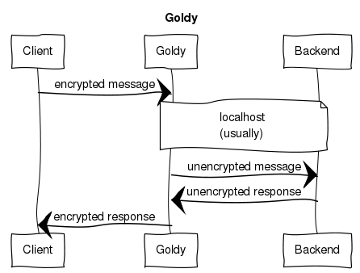

# Goldy shines for secure communications

* Date: February 19, 2016[^1]
* Author: Shmulik Regev
* Tagged: DTLS / encryption / Goldy / IoT / security

Goldy is a type of DTLS tunnel.  Before describing the specifics of Goldy,
let's roll up our sleeves and delve into what "DTLS" means.

## Secure communication

First off, the acronym stands for "Datagram Transport Layer Security"; in
layman's terms, it refers to Transport Layer Security (TLS) over a User
Datagram Protocol (UDP) connection.  UDP is used instead of TCP because for
some use cases, latency is more important than integrity (that is, it's OK to
lose some packets occasionally), and for some use cases (for example, IoT) its
light weight is preferable.  But plain UDP isn't secured, and so TLS was added
to the mix to create DTLS.  See this excellent technical overview of DTLS and
the differences between it and good old SSL.

## Goldy to the rescue

So why Goldy? Let's assume you have a device that talks DTLS, that is, it sends
encrypted communication over UDP.  But your server may not be aware of DTLS; it
accepts plain UDP.  This is where Goldy shines — it acts as a tunnel, receiving
encrypted DTLS communication, peeling off the encryption and forwarding the
plain content to a backend server.  The server's replies are encrypted and sent
to the client.  And that's all there is to it.

"But", you may scream, "isn't it bad to lose the encryption?" Well, if Goldy
and the backend server runs on the same machine, it isn't really bad.
Man-in-the-middle attacks are mostly dangerous when the content is sent
unencrypted over the wire, but when it is just being sent unencrypted between
two processes on the same machine, the risk is greatly reduced.

We decided to implement Goldy exactly for the reason mentioned above — we
didn't want to bother the backend server with the encryption task.  Or,
sometimes, you might be dealing with a legacy server that simply doesn't have
DTLS support, but you still want to use it.  Goldy uses mbedtls, an opensource
SSL/TLS implementation by ARM, and is implemented in plain C.  An asynchronous
events library, libev, is also used to achieve high throughput and to support
multiple concurrent clients.

## Simple and lightweight

The code should be fairly portable and overall Goldy is modest in its hardware
requirements, totalling less than 3000 lines of code, headers included.  The
beauty of Goldy lies in its lightweight, simple implementation.  Following are
basic commands for Goldy.

Usage:

    goldy [-hvd] -g log_level -l listen_host:port -b backend_host:port
          -c cert_pem_file -k private_key_pem_file

Options:

    -h, --help                 this help
    -v, --version              show version and exit
    -d, --daemonize            run as a daemon
    -g, --log=log level        log level DEBUG/INFO/ERROR
    -l, --listen=ADDR:PORT     listen for incoming DTLS on addr and UDP port
    -b, --backend=ADDR:PORT    proxy UDP traffic to addr and port
    -c, --cert=FILE            TLS certificate PEM filename
    -k, --key=FILE             TLS private key PEM filename
    -t, --timeout=FILE         Session timeout (seconds)

## What's in a name?

One other thing to mention.  I've had a few questions about the name "Goldy."
Well, it's actually a tribute to Eran Zahavi, the best player on my favorite
soccer team, Maccabi Tel Aviv.  "Zahav" is Hebrew for "gold," so Zahavi is
Goldy.  You never know where you'll find inspiration.

[^1]: Note: this blog post was previously published on developer.ibm.com
